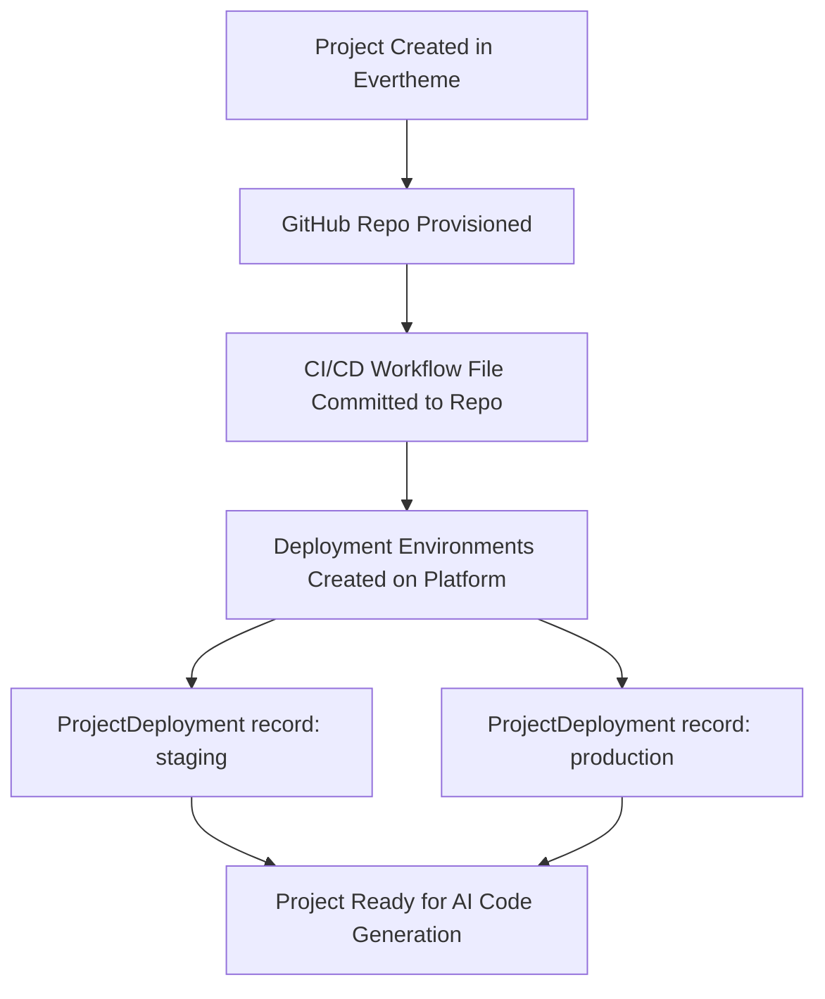
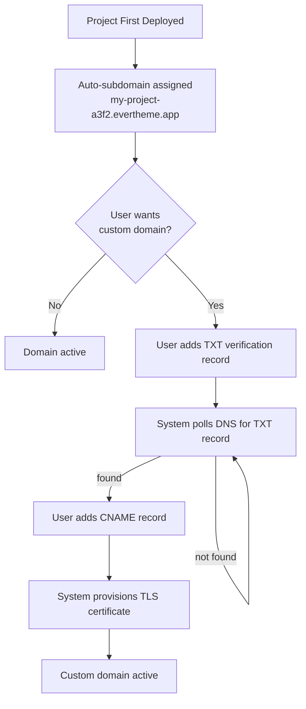
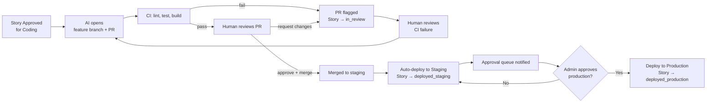
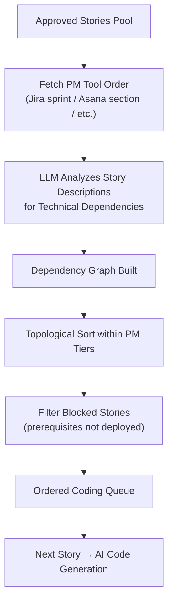

# Evertheme — Future Enhancements

**Prepared:** March 2026  
**Scope:** Two planned enhancements that extend Evertheme from a requirements backlog tool into a
full AI-driven development pipeline — from approved user stories to deployed, live applications.

---

## Overview

The current application converts requirement documents into reviewed, version-controlled user story
backlogs and exports them to PM tools (Jira, Asana, Trello, Azure DevOps). The two enhancements
described here extend that lifecycle in both directions:

1. **AI Code Generation** — once stories are approved, the system provisions a GitHub repository,
   triggers AI-driven code generation per story, manages a CI/CD pipeline, and deploys the
   resulting application to a live URL.

2. **Story Progress Tracking** — the story lifecycle is extended to cover the coding pipeline,
   with hybrid PM-tool + AI-driven prioritization and automated status transitions driven by
   GitHub webhooks and CI results.

```mermaid
flowchart LR
  reqDoc["Requirement Document"] --> storyGen["AI Story Generation"]
  storyGen --> storyReview["Review & Approval"]
  storyReview --> prioritize["Priority Engine"]
  prioritize --> codegen["AI Code Generation"]
  codegen --> pr["Pull Request + CI"]
  pr --> stagingDeploy["Staging Deployment"]
  stagingDeploy --> approvalGate["Human Approval Gate"]
  approvalGate --> prodDeploy["Production Deployment"]
  prodDeploy --> liveURL["Live URL"]
```



---

## Prerequisites

The following must be in place before any implementation work on these enhancements can begin.
They are ordered by dependency — each group generally unlocks the next.

### Step 1 — Resolve Open Decisions

Four decisions are currently deferred (see [Open Decisions](#open-decisions) at the end of this
document). Each one is a hard blocker for a specific area of implementation:

| Decision | What it blocks |
|---|---|
| **Deployment platform** | `deployment_service.py` and the CI/CD workflow templates committed into each project repo are entirely platform-specific and cannot be written until this is chosen |
| **AI coding approach** (Option A vs B) | `code_generator.py` is architected completely differently for each option; Option B also requires external agent setup before any coding tasks can run |
| **GitHub org name** | The org must exist before any repos can be provisioned; it is stored in `ProjectRepository.github_org` |
| **Base domain** | Must be registered and DNS-delegated before auto-subdomains can be provisioned or TLS certificates requested |

---

### Step 2 — Register Domain and Configure DNS

1. Register the chosen base domain (e.g., `evertheme.app`) with a domain registrar
2. Delegate DNS management to the chosen platform's nameservers or a standalone DNS provider
   (e.g., Cloudflare, Route 53)
3. Create a wildcard `A` or `CNAME` record: `*.evertheme.app` → Evertheme's ingress IP or
   load balancer hostname
4. Obtain a wildcard TLS certificate for `*.evertheme.app` via Let's Encrypt DNS-01 challenge
   or the chosen platform's managed certificate service; configure auto-renewal

---

### Step 3 — Create GitHub Organization and Credentials

1. Create the GitHub organization (e.g., `evertheme-projects`) under the Evertheme account
2. Provision a **GitHub App** (preferred over a Personal Access Token for production) with the
   following permissions:
   - `Contents: Read & Write` — create repos, branches, commits
   - `Pull requests: Read & Write` — open PRs with story metadata
   - `Workflows: Read & Write` — commit `.github/workflows/` files to new repos
   - `Administration: Read & Write` — configure branch protection rules
   - `Webhooks: Read & Write` — register per-repo webhooks pointing back to Evertheme
3. Download the GitHub App private key (PEM); store it securely — it will be added to
   Evertheme's environment secrets
4. Install the GitHub App on the `evertheme-projects` organization
5. Generate a **webhook secret** (a random 32+ character string) to be shared between GitHub
   and Evertheme's `POST /api/v1/pipeline/webhook` endpoint for payload signature verification

> **Why a GitHub App over a PAT?** A GitHub App authenticates as the app installation (not a
> personal user account), can be scoped precisely to the org, has higher API rate limits
> (15,000 requests/hour vs 5,000 for PATs), and does not break if a team member leaves.

---

### Step 4 — Deploy Evertheme Itself

This is the most critical operational prerequisite. **GitHub webhooks require a publicly reachable
HTTPS URL** to deliver events to. The `POST /api/v1/pipeline/webhook` endpoint must be live on
the internet before any project repository can register a webhook pointing to it.

Evertheme currently has no git repository initialized and no CI/CD pipeline configured. The
following must be completed first:

1. Initialize a git repository in this project and push to a GitHub repo under your control
2. Configure Evertheme's own CI/CD pipeline — the pipeline skeleton from
   [`docs/deployment-cost-analysis.md`](deployment-cost-analysis.md) §7 applies directly:
   lint & test → build Docker images → push to registry → run Alembic migrations → deploy
3. Deploy Evertheme to one of the evaluated platforms with a real, stable public domain
   (e.g., `app.evertheme.com`)
4. Confirm the health endpoint (`GET /health`) is reachable externally
5. Record the public base URL — it will be stored in `EVERTHEME_PUBLIC_URL` and used when
   registering webhooks on each project repo Evertheme creates

---

### Step 5 — Set Up Deployment Platform Account

Once the platform is chosen (Step 1), create an account and provision API access:

| Platform | Required credential |
|---|---|
| Railway | API token from Railway dashboard → Account Settings → Tokens |
| Fly.io | `fly auth token` via Fly CLI |
| Google Cloud Run | Service account JSON key with `Cloud Run Admin` + `Cloud SQL Client` roles |
| Render | API key from Render dashboard → Account Settings → API Keys |

The API token is used by `deployment_service.py` to programmatically create and manage
deployment environments for each generated project.

---

### Step 6 — Configure External Coding Agent (Option B Only)

Skip this step if Option A (extend existing LLM service) is chosen.

If Option B (external coding agent webhook) is chosen:

1. Set up the external agent service (Cursor background agent, GitHub Copilot Workspace, or
   equivalent)
2. Obtain the agent's inbound webhook URL and API key
3. Configure the agent's outbound callback to point to Evertheme's
   `POST /api/v1/pipeline/webhook` endpoint when a PR is opened
4. Test the round-trip: Evertheme fires outbound webhook → agent creates branch + PR →
   GitHub webhook fires back → Evertheme updates story status

---

### Step 7 — Add New Environment Variables

The existing [`.env.example`](.env.example) must be extended with the following before the new
services can run. Add these to both `.env.example` (as documentation) and to the production
secrets manager on the chosen deployment platform.

```bash
# ── GitHub Integration ────────────────────────────────────────────────────────
GITHUB_ORG=evertheme-projects
GITHUB_APP_ID=                         # numeric App ID from GitHub App settings
GITHUB_APP_PRIVATE_KEY=                # contents of the downloaded .pem key file
GITHUB_APP_INSTALLATION_ID=            # installation ID for the org
GITHUB_WEBHOOK_SECRET=                 # shared secret for X-Hub-Signature-256 validation

# ── Deployment Platform ───────────────────────────────────────────────────────
# Fill in only the platform that was chosen in Step 1. Remove the others.
RAILWAY_API_TOKEN=
FLY_API_TOKEN=
RENDER_API_KEY=
GCP_PROJECT_ID=                        # Cloud Run only

# ── Domain ────────────────────────────────────────────────────────────────────
BASE_DOMAIN=evertheme.app              # base for auto-provisioned project subdomains
EVERTHEME_PUBLIC_URL=                  # e.g. https://app.evertheme.com

# ── Coding Agent (Option B only) ─────────────────────────────────────────────
CODING_AGENT_WEBHOOK_URL=              # URL to POST story payloads to
CODING_AGENT_API_KEY=                  # auth key for the external agent
```

---

### Step 8 — Author Alembic Database Migrations

The four new models (`ProjectRepository`, `ProjectDeployment`, `ProjectDomain`,
`StoryCodeTask`) each require a new Alembic migration before any of the new API routes can
function. These migrations must be authored, reviewed, and tested against the existing schema
before any feature branch goes to staging.

Suggested migration order to respect foreign key dependencies:

1. `project_repositories` (FK → `projects`)
2. `project_deployments` (FK → `projects`, `project_repositories`)
3. `project_domains` (FK → `projects`)
4. `story_code_tasks` (FK → `stories`, `projects`, `project_repositories`)

---

### Prerequisites Summary

```
Step 1 — Resolve open decisions
        ├── Deployment platform
        ├── AI coding approach (Option A or B)
        ├── GitHub org name
        └── Base domain
Step 2 — Register domain + configure wildcard DNS + obtain wildcard TLS cert
Step 3 — Create GitHub org + provision GitHub App + generate webhook secret
Step 4 — Deploy Evertheme itself (git repo → CI/CD → live public URL)
Step 5 — Set up deployment platform account + obtain API token
Step 6 — Configure external coding agent  [Option B only]
Step 7 — Add new environment variables to .env.example + production secrets
Step 8 — Author and test Alembic migrations for four new models
```

None of Steps 2–8 require application code changes — they are infrastructure and account setup
that unlock the implementation work described in the enhancements below.

---

## Enhancement 1: AI Code Generation from User Stories

### 1.1 Codebase Storage — GitHub Repository per Project

Each Evertheme project maps 1-to-1 with a dedicated GitHub repository. The repository is created
automatically when a project is first set up for code generation.

**Hosting model:**
- Evertheme controls a GitHub organization (e.g., `evertheme-projects`)
- Each project repo is created via the GitHub REST API using a stored organization token
- Repositories are private by default; visibility is configurable per project

**Branch strategy:**

| Branch | Purpose | Deploy target |
|---|---|---|
| `main` | Production-ready code | Production environment |
| `staging` | Integration branch; merged stories awaiting approval | Staging environment |
| `story/{id}-{slug}` | Per-story feature branch opened by the AI agent | — (PR only) |

**On project creation, the system automatically:**
1. Creates the GitHub repo via the GitHub API
2. Commits a starter CI/CD workflow file (`.github/workflows/ci.yml`) bootstrapped from the
   project's tech stack
3. Creates `main` and `staging` branches
4. Creates deployment environments (`staging`, `production`) in GitHub with branch protection rules
5. Registers the repo URL and configuration in the `ProjectRepository` model

**New data model — `ProjectRepository`** (`backend/app/models/repository.py`):

```python
class ProjectRepository(Base):
    __tablename__ = "project_repositories"

    id: UUID  # primary key
    project_id: UUID  # FK → projects.id
    github_org: str   # e.g. "evertheme-projects"
    github_repo: str  # e.g. "my-project-abc123"
    github_url: str   # https://github.com/evertheme-projects/my-project-abc123
    default_branch: str   # "main"
    staging_branch: str   # "staging"
    tech_stack: str | None  # e.g. "nextjs-fastapi", "react-node", etc.
    created_at: datetime
    updated_at: datetime
```

---

### 1.2 Deployment Infrastructure Setup

When a project repository is provisioned, a corresponding deployment environment is created on
the chosen hosting platform. The deployment platform is **not yet decided** — the following
options are evaluated below. The existing
[`docs/deployment-cost-analysis.md`](deployment-cost-analysis.md) covers the full cost breakdown
for each platform.

#### Platform Options for Project Deployments

Each generated project application requires: a backend service, a frontend service, a managed
PostgreSQL database, and file storage. The CI/CD pipeline commits Docker images and triggers
deployments.

| Platform | Starter cost | Scale-to-zero | Setup complexity | Best for |
|---|---|---|---|---|
| **Railway** | ~$29/mo | No | Lowest | Fastest path; Docker Compose compatible |
| **Fly.io** | ~$23/mo | No | Low | Cheapest always-on; global edge |
| **Google Cloud Run** | ~$22–37/mo | **Yes** | Medium | Uneven/low traffic; generous free tier |
| **Render** | ~$51/mo | No | Low | Predictable fixed billing |
| **AWS ECS Fargate** | ~$70/mo | No | High | Enterprise compliance |
| **Azure Container Apps** | ~$71/mo | Partial | Medium | Azure OpenAI / Azure DevOps users |

**Recommended starting point:** Railway or Google Cloud Run. Railway offers the fastest
time-to-live-project with its Docker-native model. Cloud Run is preferred when projects are
expected to have sparse traffic and cost efficiency matters most.

**New data model — `ProjectDeployment`** (`backend/app/models/repository.py`):

```python
class ProjectDeployment(Base):
    __tablename__ = "project_deployments"

    id: UUID  # primary key
    project_id: UUID          # FK → projects.id
    repository_id: UUID       # FK → project_repositories.id
    environment: str          # "staging" | "production"
    platform: str             # "railway" | "fly" | "cloudrun" | "render" | "ecs" | "aca"
    deploy_url: str | None    # https://my-project.up.railway.app
    last_deploy_sha: str | None
    # status: pending | deploying | live | failed | paused
    status: str
    deployed_at: datetime | None
    created_at: datetime
    updated_at: datetime
```

**Infrastructure provisioning flow:**



---

### 1.3 AI Code Writing Integration

The AI code writing step takes an approved user story and produces a pull request on the project's
GitHub repository. Two implementation options are documented below; the final approach is
**not yet decided**.

#### Option A — Extend the Existing LLM Service

Add a `code_generator.py` service to the existing `backend/app/services/` layer. This service
would call the existing LLM provider abstraction (`backend/app/services/llm/`) with
code-generation prompts, then commit the resulting code to a feature branch via the GitHub API
and open a pull request.

**How it works:**
1. Story is marked `approved`; a `StoryCodeTask` record is created
2. `code_generator.py` fetches the current repo file tree from GitHub
3. Constructs a prompt containing the story title, description, acceptance criteria, and relevant
   existing code context
4. Calls the project's configured LLM provider (OpenAI, Anthropic, Azure OpenAI, or Ollama)
5. Parses the response into file diffs; commits them to a new `story/{id}-{slug}` branch
6. Opens a pull request targeting `staging`; updates `StoryCodeTask` with the PR URL

**Pros:**
- No new external dependencies; reuses existing LLM provider abstraction
- Single system boundary; simpler auth and secret management
- Works with any LLM provider already configured per-user

**Cons:**
- General-purpose LLMs are not purpose-built coding agents; code quality may be lower
- No IDE context, LSP, or static analysis integration
- Large codebases may exceed context window limits; requires intelligent file chunking

#### Option B — External Coding Agent via Webhook

When a story is approved, Evertheme fires a webhook to an external coding agent (e.g., a Cursor
background agent, GitHub Copilot Workspace, or an OpenAI Codex-powered agent). The agent
operates in the GitHub repository directly and opens a pull request when done. Evertheme then
receives a webhook from GitHub when the PR is created.

**How it works:**
1. Story is marked `approved`; Evertheme fires an outbound webhook with story payload
2. The coding agent clones the repo, reads the story, and writes code with full IDE tooling
3. Agent opens a PR on the `story/{id}-{slug}` branch
4. GitHub PR webhook fires → Evertheme's `/api/v1/pipeline/webhook` endpoint updates
   `StoryCodeTask` status to `in_review`

**Pros:**
- Purpose-built coding agents produce significantly higher quality code
- Full repo context, linting, and test execution during code generation
- Agent can iteratively fix test failures before opening the PR

**Cons:**
- External dependency on a third-party agent API; availability risk
- More complex orchestration (outbound webhook + inbound GitHub webhook)
- Additional API key management and per-story cost tracking needed

#### New service — `github_service.py`

Regardless of which Option is chosen, a `github_service.py` is required to interact with the
GitHub REST API. Key responsibilities:

- Create repositories in the Evertheme GitHub org
- Create and push branches
- Commit files (individual or batch via Git Trees API)
- Open pull requests with story metadata in the PR description
- Register/manage GitHub repository webhooks
- Query CI/Actions run status

---

### 1.4 Domain Strategy

Every deployed project receives a URL. Two approaches are supported:

#### Default: Automatic Subdomain

Every project gets a subdomain under `evertheme.app` automatically upon first deployment.

- **Format:** `{project-slug}.evertheme.app`
- **DNS:** Wildcard DNS record `*.evertheme.app` → Evertheme's ingress/reverse proxy
- **Routing:** The Nginx/Caddy reverse proxy inspects the `Host` header and routes to the
  correct deployment container or platform service
- **TLS:** Wildcard certificate provisioned via Let's Encrypt; renewed automatically

The `project-slug` is derived from the project name (lowercased, special characters replaced with
hyphens, truncated to 48 characters) with a short unique suffix appended to avoid collisions.

**Example:** A project named "My E-commerce App" → `my-e-commerce-app-a3f2.evertheme.app`

#### Optional: Custom Domain

Project owners can configure a custom domain in the project settings. The verification flow:

1. User enters their custom domain (e.g., `app.mycompany.com`) in the Domain Configuration UI
2. Evertheme generates a DNS verification token and instructs the user to add a `TXT` record:
   `_evertheme-verify.app.mycompany.com → evertheme-verify={token}`
3. Evertheme polls DNS (or the user triggers re-verification) until the `TXT` record resolves
4. Once verified, the user updates their DNS to add a `CNAME`:
   `app.mycompany.com → {project-slug}.evertheme.app`
5. Evertheme provisions a dedicated TLS certificate via Let's Encrypt ACME HTTP-01 or DNS-01
   challenge
6. The reverse proxy begins accepting requests on the custom domain

**New data model — `ProjectDomain`** (`backend/app/models/repository.py`):

```python
class ProjectDomain(Base):
    __tablename__ = "project_domains"

    id: UUID  # primary key
    project_id: UUID             # FK → projects.id
    subdomain_slug: str          # "my-e-commerce-app-a3f2"
    custom_domain: str | None    # "app.mycompany.com"
    # dns_status: unverified | verified | active | error
    dns_status: str
    tls_status: str              # pending | provisioning | active | error
    verification_token: str | None
    verified_at: datetime | None
    created_at: datetime
    updated_at: datetime
```



---

### 1.5 Deployment Readiness — Hybrid Gate

A project deployment requires **both** conditions to be satisfied before it reaches production:

1. **CI pipeline must pass** — linting, unit tests, Docker build, and integration tests all green
2. **Human approval required** — a project admin reviews the CI result and explicitly approves
   the production deployment

Staging is less strict: merges to `staging` deploy automatically when CI passes (no human gate).

**Gate rules by environment:**

| Environment | Trigger | CI required | Human approval |
|---|---|---|---|
| Staging | Story PR merged to `staging` | Yes | No |
| Production | Human clicks "Approve for Production" | Yes (must already be green) | **Yes** |

**Deployment flow:**



---

## Enhancement 2: User Story Progress Tracking

### 2.1 Extended Story Status Lifecycle

The existing `Story.status` field uses four values: `draft | reviewed | approved | exported`.
The coding pipeline extends this with six additional states that track a story through the
development and deployment process.

**Full status lifecycle:**

| Status | Description | Trigger |
|---|---|---|
| `draft` | Story created, not yet reviewed | AI generation or manual creation |
| `reviewed` | AI review complete; feedback attached | `StoryReview` created |
| `approved` | Accepted by user; queued for coding | Human approval action |
| `exported` | Pushed to PM tool (Jira, Asana, etc.) | PM export action |
| `coding` | AI agent actively generating code | `StoryCodeTask` created, coding started |
| `in_review` | PR opened; awaiting human code review | GitHub PR webhook |
| `testing` | PR merged to staging; CI running | GitHub merge webhook |
| `deployed_staging` | CI passed; live on staging environment | CI success webhook |
| `deployed_production` | Approved and live on production | Human approval + deploy webhook |

> **Note:** `approved` and `exported` are not mutually exclusive — a story can be exported to a
> PM tool and still proceed through the coding pipeline independently.

**New data model — `StoryCodeTask`** (`backend/app/models/codetask.py`):

```python
class StoryCodeTask(Base):
    __tablename__ = "story_code_tasks"

    id: UUID  # primary key
    story_id: UUID               # FK → stories.id
    project_id: UUID             # FK → projects.id
    repository_id: UUID          # FK → project_repositories.id
    feature_branch: str          # "story/42-user-login"
    pr_url: str | None           # GitHub PR URL
    pr_number: int | None
    ci_run_url: str | None       # GitHub Actions run URL
    ai_job_id: str | None        # External agent job reference (Option B)
    # pipeline_status: queued | coding | in_review | testing | deployed_staging | deployed_production | failed
    pipeline_status: str
    failure_reason: str | None
    coding_started_at: datetime | None
    pr_opened_at: datetime | None
    merged_at: datetime | None
    deployed_staging_at: datetime | None
    deployed_production_at: datetime | None
    created_at: datetime
    updated_at: datetime
```

---

### 2.2 Priority Determination — Hybrid Approach

The order in which stories are sent to the AI coding agent is determined by a **hybrid priority
engine** that combines two signals:

**Signal 1 — PM Tool Order (primary)**
The connected PM integration (Jira sprint ordering, Asana section order, Trello card position,
Azure DevOps backlog rank) provides the human-curated base priority. This is pulled via the
existing integration services in `backend/app/services/integrations/`.

**Signal 2 — AI Dependency Adjustment (secondary)**
The LLM analyzes the set of approved stories and identifies technical dependencies — for example,
a "Create User Account" story must be coded before a "User Login" story. The AI reorders stories
within the same priority tier to ensure upstream work is completed first.

Additional ordering rules applied within each priority tier:
- **Unblocked first**: stories with no incomplete prerequisites are surfaced before blocked ones
- **Complexity estimate**: lower story-point stories are preferred within a tier to increase
  throughput and reduce WIP

**New service — `story_prioritizer.py`** (`backend/app/services/story_prioritizer.py`):

```python
class StoryPrioritizer:
    async def prioritize(self, project_id: UUID) -> list[UUID]:
        """
        Returns an ordered list of story IDs ready for coding.
        1. Fetch PM tool order for approved stories via integration service
        2. Call LLM to identify dependency pairs among the stories
        3. Perform topological sort within PM-ordered tiers
        4. Filter out stories that are blocked (prerequisites not yet deployed)
        5. Return ordered list; first story is next to be coded
        """
```

**Priority flow:**



---

### 2.3 Completion Tracking — Webhook-Driven Status Transitions

Story status transitions in the coding pipeline are driven by **GitHub webhook events** delivered
to a new Evertheme endpoint. This keeps story status automatically in sync with real GitHub
activity without polling.

**Webhook events and resulting transitions:**

| GitHub Event | Payload condition | Story status transition |
|---|---|---|
| `pull_request` (opened) | PR branch matches `story/{id}-*` | `coding` → `in_review` |
| `pull_request` (closed, merged=false) | PR closed without merge | `in_review` → `coding` (retry) |
| `pull_request` (closed, merged=true) | PR merged to `staging` | `in_review` → `testing` |
| `workflow_run` (completed, conclusion=success) | CI run on `staging` branch | `testing` → `deployed_staging` |
| `workflow_run` (completed, conclusion=failure) | CI run on `staging` branch | `testing` → `in_review` (flagged) |
| `deployment_status` (success, env=production) | Platform deploy event | → `deployed_production` |

**New router — `pipeline.py`** (`backend/app/routers/pipeline.py`):
- `POST /api/v1/pipeline/webhook` — receives signed GitHub webhook payloads, validates the
  `X-Hub-Signature-256` header, routes events to the appropriate handler, and updates
  `StoryCodeTask` + `Story.status` accordingly.
- `GET /api/v1/pipeline/{project_id}/status` — returns current pipeline status for all stories
  in a project.
- `POST /api/v1/pipeline/{project_id}/approve-production` — human approval gate endpoint;
  triggers the production deploy after CI has passed.

**New router — `codegen.py`** (`backend/app/routers/codegen.py`):
- `POST /api/v1/codegen/stories/{story_id}/start` — manually trigger AI code generation for
  a specific approved story.
- `POST /api/v1/codegen/stories/{story_id}/cancel` — cancel an in-progress code generation job.
- `POST /api/v1/codegen/stories/{story_id}/retry` — retry a failed code generation task.
- `GET /api/v1/codegen/projects/{project_id}/queue` — return the prioritized coding queue for
  a project (calls `StoryPrioritizer.prioritize`).

---

## New Files Summary

### Backend Models

| File | Models |
|---|---|
| `backend/app/models/repository.py` | `ProjectRepository`, `ProjectDeployment`, `ProjectDomain` |
| `backend/app/models/codetask.py` | `StoryCodeTask` |

### Backend Services

| File | Responsibility |
|---|---|
| `backend/app/services/github_service.py` | GitHub API: repo creation, branches, commits, PRs, webhooks |
| `backend/app/services/code_generator.py` | AI code generation orchestration (Option A or B) |
| `backend/app/services/story_prioritizer.py` | Hybrid PM-tool + AI dependency priority ordering |
| `backend/app/services/deployment_service.py` | Platform deployment triggers (Railway / Fly / Cloud Run / Render) |
| `backend/app/services/domain_service.py` | Subdomain slug generation, DNS verification, TLS provisioning |

### Backend Routers

| File | Endpoints |
|---|---|
| `backend/app/routers/codegen.py` | Start / cancel / retry code generation; view coding queue |
| `backend/app/routers/deployments.py` | Deployment management; approve production; domain config |
| `backend/app/routers/pipeline.py` | GitHub webhook receiver; pipeline status; approval gate |

### Frontend Components

| Component | Purpose |
|---|---|
| `StoryPipelineBoard` | Kanban-style board showing stories across all coding pipeline stages |
| `DeploymentStatusPanel` | Per-project panel: staging + production URLs, last deploy time, CI badge |
| `DomainConfigPanel` | Custom domain input, DNS verification instructions, TLS status |
| `ApprovalQueue` | Notification list for PRs awaiting code review and deployments awaiting production approval |

---

## Open Decisions

| Decision | Options | Status |
|---|---|---|
| Deployment platform for generated projects | Railway, Fly.io, Google Cloud Run, Render (see §1.2) | Not decided |
| AI coding integration approach | Option A (extend LLM service) vs Option B (external agent webhook) | Not decided |
| GitHub org name for project repos | e.g., `evertheme-projects` | Not decided |
| Subdomain base domain | e.g., `evertheme.app` — requires domain registration | Not decided |

---

*Document generated for the Evertheme project · March 2026*
