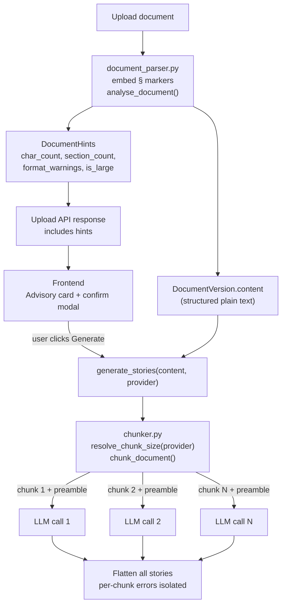

# Large Document Support

## Overview

This document describes the architecture and implementation of large requirements document support in everapps. It replaces the previous hardcoded 12,000-character truncation with a structure-aware, provider-optimised chunking pipeline that ensures every part of a document is processed, while surfacing a pre-generation advisory to the user for large or low-quality-format documents.

---

## Problem

The original implementation silently truncated any document to 12,000 characters before sending it to the LLM:

```python
# story_generator.py (before)
user_prompt = USER_PROMPT_TEMPLATE.format(document_content=document_content[:12000])
```

12,000 characters is approximately 4–6 pages of standard prose. Any requirements beyond that were silently ignored with no warning shown to the user.

---

## Solution Architecture



---

## Phase 1 — Section-aware parsing + document analysis

**File: `backend/app/services/document_parser.py`**

### Section markers

`[§ Section Heading]` markers are embedded into the extracted plain text at heading boundaries during the parse step. This means the structured text is stored in the database and available for all future operations without re-parsing.

Detection per format:

- **DOCX** — `paragraph.style.name` exposes `Heading 1`, `Heading 2`, etc. directly via `python-docx`.
- **Markdown** — `#`/`##`/`###` headers are normalised to `[§ …]` marker format.
- **PDF** — heuristic: short lines (< 80 chars) followed by a blank line, or `^\d+\.\s+[A-Z]` numbered sections.
- **TXT** — same PDF heuristic plus ALL-CAPS lines (≤ 60 chars).

Stored text example:

```
[§ Introduction]
This system shall provide...

[§ Functional Requirements]
1.1 The user shall be able to log in...
```

### `analyse_document(text, file_type) -> DocumentHints`

Computes advisory metadata from already-extracted text at upload time — no extra LLM call needed.

| Field | Description |
|---|---|
| `char_count` | Total character count of extracted text |
| `section_count` | Number of `[§ …]` markers detected |
| `is_large` | `True` when `char_count > 20,000` (~10 pages / 5,000 words) |
| `estimated_chunks` | `ceil(char_count / 12,000)` — indicative, based on fallback default |
| `format_warnings` | Per-format advice list (see below) |
| `processing_note` | Populated only when `is_large` |

Format warnings:

| Format | Warning |
|---|---|
| `.txt` | "Plain text has limited section detection. Converting to .docx will improve story grouping accuracy." |
| `.pdf` | "PDF section detection uses heuristics and may miss some boundaries. .docx provides the most accurate results." |
| `.md` | (none — heading markers are well-supported) |
| `.docx` | (none — best supported format) |

---

## Phase 2 — Schema changes

**File: `backend/app/schemas/document.py`**

`DocumentHints` is a Pydantic model added to the schemas module and attached as an optional field on `DocumentWithContentOut`. No database migration is required — hints are computed on-the-fly at upload time.

```python
class DocumentHints(BaseModel):
    char_count: int
    section_count: int
    is_large: bool
    estimated_chunks: int
    format_warnings: list[str]
    processing_note: str | None

class DocumentWithContentOut(DocumentOut):
    latest_content: str | None = None
    hints: DocumentHints | None = None
```

---

## Phase 3 — Router: attach hints to upload responses

**File: `backend/app/routers/documents.py`**

Both `upload_document` and `reupload_document` call `analyse_document` after parsing and attach the result to the response. The `get_document` endpoint also computes and returns hints since it already loads `latest_content`.

---

## Phase 4 — Chunker service

**File: `backend/app/services/chunker.py`**

### Provider-aware token budgets

`resolve_chunk_size(provider) -> int` inspects `provider.provider_name` and `provider.config.model` at call time. The chunk character budget is computed as:

```
chunk_chars = (context_window_tokens × 4 chars/token × 0.60 utilisation)
              − overhead_tokens × 4
```

Where overhead accounts for the system prompt (~500 tokens) and expected output (~4,096 tokens).

| Provider | Model pattern | Context tokens | Safe chunk (chars) |
|---|---|---|---|
| openai | gpt-4o, gpt-4o-mini | 128 K | ~275,000 |
| anthropic | claude-* | 200 K | ~445,000 |
| azure_openai | any | 128 K | ~275,000 |
| ollama | any | 4 K (conservative) | ~9,600 |
| fallback | — | — | 12,000 |

This adapts automatically when a user switches their LLM in the settings UI.

### Section-aware splitting

`chunk_document(text, chunk_size, overlap) -> list[str]`:

1. Split on `[§ …]` markers — logical sections first.
2. Accumulate sections into chunks up to `chunk_size`.
3. If a single section exceeds `chunk_size`, fall back to `\n\n` paragraph splits within it.
4. If a single paragraph exceeds `chunk_size`, hard-split at `chunk_size`.
5. Apply `overlap` chars at boundaries by repeating the tail of the previous chunk.

### Context preamble injection

`build_preamble(chunk) -> str` prepends a header to each chunk listing which sections it contains:

```
[Document context — do not generate stories from this section]
Sections in this chunk: § Functional Requirements, § Authentication
[End context]

[§ Functional Requirements]
...actual content...
```

This gives every LLM call awareness of the broader document structure, even when processing a sub-section.

---

## Phase 5 — Updated story generator

**File: `backend/app/services/story_generator.py`**

- The `[:12000]` hard slice is removed.
- `generate_stories` calls `resolve_chunk_size(provider)` and `chunk_document(...)`.
- Single-chunk documents (content fits within the provider budget) make one LLM call — identical to previous behaviour, no regression.
- Multi-chunk documents use `asyncio.Semaphore(max_concurrent)` to cap parallel LLM calls.
- Each chunk call is wrapped in `try/except`. Failed chunks are logged and skipped rather than aborting the entire generation with an HTTP 502.

---

## Phase 6 — Configuration

**File: `backend/app/config.py`**

Two new settings (both configurable via env vars):

| Setting | Default | Description |
|---|---|---|
| `DOC_CHUNK_OVERLAP` | `200` | Chars of overlap between adjacent chunks |
| `DOC_MAX_CONCURRENT_CHUNKS` | `3` | Maximum parallel LLM calls during generation |

Chunk size is **not** a fixed env var — it is resolved dynamically per provider at generation time.

---

## Phase 7 — Frontend advisory UI

**Files: `frontend/src/types/index.ts`, `frontend/src/app/(dashboard)/projects/[id]/page.tsx`**

### Post-upload advisory card

After a successful upload, if the response contains hints with `is_large = true` or non-empty `format_warnings`, a dismissible amber card is shown below the upload zone:

```
⚠ Large document detected (8,432 words · 4 sections)
  • This document will be processed in ~3 sections. Generation may take longer.
  • Plain text format has limited section detection. Consider converting to .docx.
  [×]
```

Hints are stored in component state keyed by document ID. They persist until the user dismisses the card or navigates away.

### Pre-generate confirmation modal

When the user clicks "Generate stories" on a document that has hints with warnings, a modal intercepts the action:

```
Generate Stories — Large Document
──────────────────────────────────
⏱  Extra processing time
   This document will be split into ~3 sections. This may take 1–3 minutes.

⚠  Format suggestion
   Plain text format has limited section detection. Converting to .docx
   will improve story grouping accuracy.

⚠  Potential risks
   Stories near section boundaries may occasionally overlap. Review
   the generated backlog for duplicates.

                      [Cancel]  [Generate anyway →]
```

Documents with no warnings bypass the modal entirely and generate immediately.

---

## LLM Limitations & Mitigations

| Limitation | Mitigation implemented |
|---|---|
| Context window ceiling per provider | `resolve_chunk_size` auto-scales to 60% of each model's window |
| Rate limits (RPM/TPM) | `asyncio.Semaphore(DOC_MAX_CONCURRENT_CHUNKS)` caps parallel calls |
| Story duplication at chunk boundaries | `overlap` chars of repeated context reduce mid-requirement splits |
| Single bad LLM response aborting generation | Per-chunk `try/except` — failed chunks are skipped, not fatal |
| JSON output reliability | Smaller focused chunks are more reliable than one huge prompt |
| Ollama local model variability | Conservative 4K token default; user can tune via model selection |

---

## Behaviour Summary

- Short documents on GPT-4o or Claude make a **single LLM call** — zero change in behaviour or cost.
- Large documents are split at `[§ section]` boundaries first, then paragraph breaks — never mid-sentence.
- Every chunk carries a context preamble listing its sections for improved story accuracy.
- Hints are computed at upload time; no database migration is required.
- The `/stories/generate` endpoint response shape is unchanged.
- LLM provider files and the stories router are untouched.
